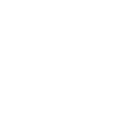

<p align="center">
  <a href="https://useshape.org">
    
  </a>
</p>

<h2 align="center">The desktop IDE for agentic software</h2>

<p align="center">
  <a href="https://useshape.org"></a>
  ·
  <a href="https://useshape.org/docs/introduction/quick-start">Documentation</a>
  ·
  <a href="https://useshape.org/download">Download</a>
</p>

# Why Shape

Shape is a signed-in desktop IDE: chat, editor, Git, terminal, and a real in-app browser in one window. The agent reads the repo, edits files, runs commands, and can pause on click-through questions when it actually needs a decision.

You ship the app like the rest of your stack — locally, with tests, and with a native Windows build.

# Installation

### Download

The fastest way to get started is the Windows installer:

```text
https://useshape.org/download
```

Sign in, open a folder, and start a chat.

### Build from source

Install Node.js 18+, Rust, and [Tauri 2 prerequisites](https://v2.tauri.app/start/prerequisites/), then:

```bash
cd shape
npm install
npm run tauri:dev
```

See [CONTRIBUTING.md](./CONTRIBUTING.md) and the [local development guide](https://useshape.org/docs/developing/local-development).

# In the box

Shape gives you the pieces of a modern coding environment and lets the agent drive them.

- **Agent chat** — Code, Ask, Plan, and Review. Tools for files, grep, terminal, Git, plugins, and image/SVG generation. When the agent needs a real decision, it can show numbered click-through questions instead of a wall of prose.
- **Workbench** — Editor, files, source control, Git graph, pull requests, and terminal docked next to chat.
- **Browser** — A workspace Browser tab with URL bar, back/forward, and design inspect on local sites.
- **Design runtime** — The `runtime/` bundle (React + Tailwind in the page) powers live HTML/design previews.

Want to go deeper? Read the [user docs](https://useshape.org/docs/introduction/quick-start) or the [developer reference](https://useshape.org/docs/developing/overview).

# Stack

- [TypeScript](https://www.typescriptlang.org/)
- [Next.js](https://nextjs.org/) (App Router)
- [Tauri 2](https://v2.tauri.app/) + [Rust](https://www.rust-lang.org/)
- [React](https://react.dev/)
- [PostgreSQL](https://www.postgresql.org/) on the cloud side for accounts and usage

# Contributing

See [CONTRIBUTING.md](./CONTRIBUTING.md). Code you submit is licensed under [BUSL-1.1](./LICENSE), same as the rest of the repo.

```bash
npm run test          # Vitest (builds runtime first)
npm run test:rust     # Cargo
npm run test:all      # Both
```

# License

Shape is licensed under the [Business Source License 1.1](./LICENSE) (BUSL-1.1).

Copyright © 2026 Shape.
