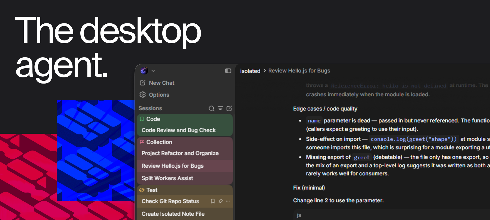

If you're using version 1.0.0, we recommend manually updating to 1.0.1 for fixed performance and a fix for the updater.



<h2>The desktop agent for anything</h2>

<p>
  
  <a href="https://useshape.org">Website</a>
  ·
  
  <a href="https://useshape.org/docs/introduction/quick-start">Documentation</a>
  ·
  
  <a href="https://useshape.org/download">Download</a>
  ·
  
  <a href="https://discord.gg/MMCEDVZKYf">Discord</a>
</p>

</div>

Shape brings your workspace, terminal, commits, and agents together in one desktop app. With agents that can work directly in your project, understanding your code, making changes, running commands, testing and spawning subagents.


# Installation

### Download

The easiest way to get started is the [Installer](https://useshape.org/download).

For specific versions and previous releases, see:
[Releases](https://github.com/useshape/Shape/releases)

Stable and Nightly are the available update channels. Stable provides tested releases, while Nightly includes the latest changes and may contain breaking changes.

---

### Build from source 

Install Node.js 18+, Rust, and [Tauri 2 prerequisites](https://v2.tauri.app/start/prerequisites/), then:

```bash
cd shape
npm install
npm run tauri:dev
```

See [CONTRIBUTING.md](./CONTRIBUTING.md) and the [local development guide](https://useshape.org/docs/developing/local-development).

# In the box

Shape brings your coding environment into one workspace and gives the agent access to the tools it needs to work on your project.

* **Agent**: Work with your code, files, terminal, Git, and more through chat.
* **Workbench**: Editor, files, Git, terminal, and other tools in one workspace.

And more coming soon!

For more, see the [user docs](https://useshape.org/docs/introduction/quick-start) or [developer reference](https://useshape.org/docs/developing/overview).

# Stack

*  [TypeScript](https://www.typescriptlang.org/)
*  [React](https://react.dev/)
*  [Next.js](https://nextjs.org/) (App Router)
*  [Tauri 2](https://v2.tauri.app/) +  [Rust](https://www.rust-lang.org/)


# Contributing

See [CONTRIBUTING.md](./CONTRIBUTING.md). Code you submit is licensed under [BUSL-1.1](./LICENSE).

```bash
npm run test          # Vitest
npm run test:rust     # Cargo
npm run test:all      # Both
```


# License

Shape is licensed under the [Business Source License 1.1](./LICENSE) (BUSL-1.1).

Copyright © 2026 Shape.
